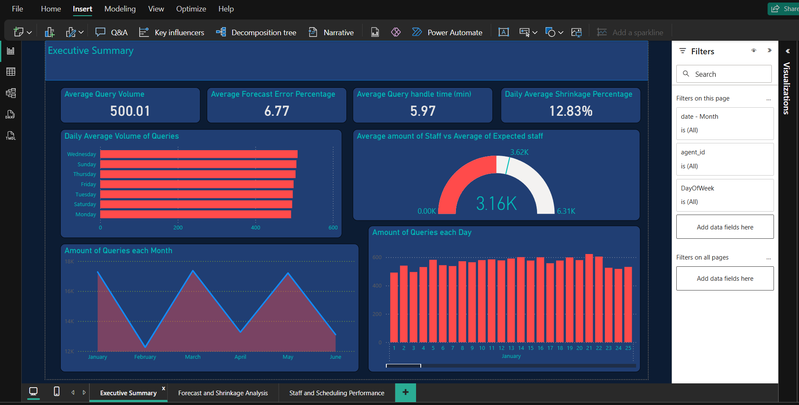
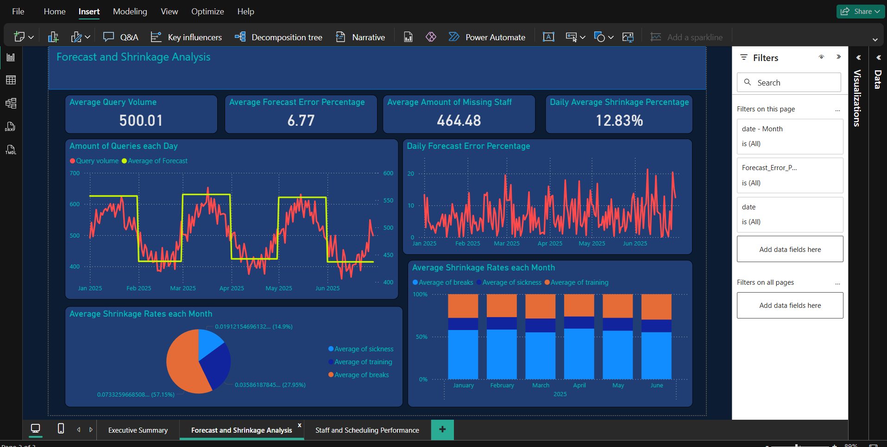
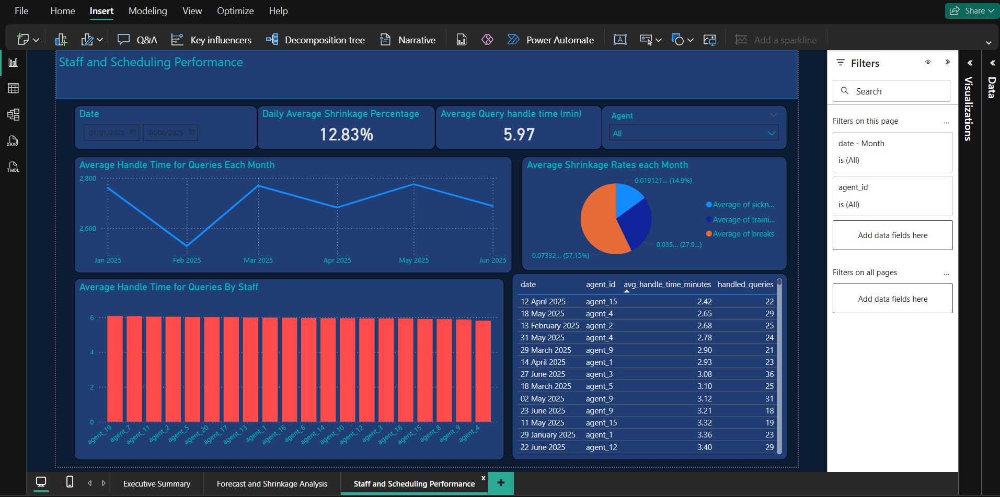

# Workforce_Management 

This project simulates a Workforce Management (WFM) analytics environment, focused on understanding and improving staffing, shrinkage, forecasting, and query performance using SQL and Power BI.

---

## Project Structure

```
Workforce_Management/
│
├── Data/
│   ├── customer_queries.csv
│   ├── handle_times.csv
│   ├── shrinkage_factors.csv
│   └── staff_schedule.csv
│
├── SQL/
│   ├── insights.sql
│   └── README.md
│
├── Screenshots/
│   ├── executive_summary.png
│   ├── forecast_and_shrinkage.png
│   └── staff_and_scheduling.png
│
└── README.md
```

---

## Project Overview

This project was created to demonstrate skills aligned with Workforce Management Analyst roles; particularly those involving:

- Forecast Accuracy  
- Handle Time Analysis   
- Shrinkage Monitoring   
- Scheduling Efficiency 
- Agent Productivity Insights 

All analyses are based on realistic datasets and showcase data modelling, querying, and visual storytelling.

---

## Key Insights (SQL)

### Average Handle Time by Agent

```sql
SELECT agent_id, AVG(avg_handle_time_minutes) AS avg_handle_time
FROM handle_times
GROUP BY agent_id
ORDER BY avg_handle_time ASC;
```

### Monthly Shrinkage %

```sql
SELECT 
    YEAR(date) AS year,
    MONTH(date) AS month,
    AVG((training + sickness + breaks) * 100) AS avg_monthly_shrinkage
FROM shrinkage_factors
GROUP BY YEAR(date), MONTH(date);
```

### Forecast Accuracy

```sql
-- Calculates Mean Absolute Error for daily forecasts
SELECT 
    cq.date,
    query_volume,
    da.daily_average_for_month,
    (ABS(query_volume - daily_average_for_month) / query_volume) * 100 AS mean_absolute_error_percentage
FROM customer_queries cq
JOIN (
    SELECT MONTH(date) AS month, AVG(query_volume) AS daily_average_for_month
    FROM customer_queries
    GROUP BY MONTH(date)
) da ON da.month = MONTH(cq.date);
```

### Staff Above Average Query Handling

```sql
-- Which staff consistently work above the daily average
SELECT agent_id, COUNT(*) AS times_above_average
FROM (
    SELECT ht.date, ht.agent_id, ht.handled_queries, da.daily_average
    FROM handle_times ht
    JOIN (
        SELECT date, AVG(handled_queries) AS daily_average
        FROM handle_times
        GROUP BY date
    ) da ON da.date = ht.date
    WHERE ht.handled_queries > da.daily_average
) result
GROUP BY agent_id
ORDER BY times_above_average DESC;
```

### Shrinkage vs Handle Time

```sql
SELECT 
    sf.date,
    (sf.training + sf.sickness + sf.breaks) AS total_shrinkage,
    AVG(ht.avg_handle_time_minutes) AS average_handle_time
FROM shrinkage_factors sf
JOIN handle_times ht ON ht.date = sf.date
GROUP BY sf.date, total_shrinkage;
```

---

## Power BI Dashboards

Three dashboard views were created to simulate real WFM monitoring.

### 🧾 Executive Summary


- Average query volume
- Forecast error
- Shrinkage %
- Daily volume by weekday
- Gauge for staffing vs expected

---

### Forecast & Shrinkage Analysis


- Query forecast vs actual
- Forecast error over time
- Monthly shrinkage breakdown (by training, sickness, breaks)

---

### Staff & Scheduling Performance


- Handle time by agent
- Handle time by month
- Agent performance table
- Shrinkage impact on total scheduled hours

---

## Tools Used

- **SQL** (MySQL-style syntax)
- **Power BI**
- **Excel (for mock data)**
- **GitHub for version control**


---
